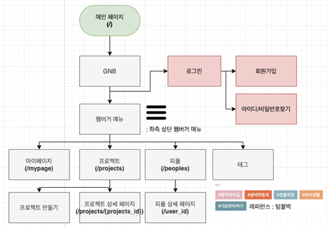
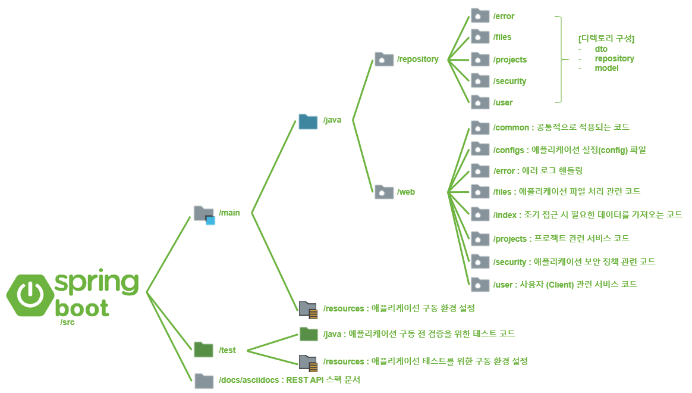

# 팀매칭 플랫폼
version 0.1.0
---

> ## **목차**  
> 
> **1. 프로젝트 소개**  

> 1. 프로젝트 목적
> 2. 프로젝트 설명

> **2. User Interface**

> 1. UI 다이어그램

> **3. 디렉토리 구성**  

> 1. Back-End 
>
> **4. 스펙 문서**  

> 1. project
> 2. user 
> 

----

## **1. 프로젝트 소개**
-------------

### **프로젝트 목적**
> 프로젝트 진행을 희망하는 인원들이 팀 빌딩부터 프로젝트 마무리까지 성공적으로 할 수 있도록 도와주는 서비스
### **프로젝트 설명**
#### **문제점**
가. IT 계열 직군을 준비하는 사람들은 제대로 된 프로젝트 경험을 할 기회가 없음

나. 프로젝트 진행 기회가 생기더라도 원하는 기술 스택을 경험하지 못하고 종료될 가능성이 높음
#### **프로젝트 팀 빌딩에 도움을 주는 서비스**
가. 사용자가 원하는 기술 스택을 요구하는 프로젝트 팀에 매칭

나. 각 사용자가 가진 실력을 검증하기 위해 프로젝트 경험을 등급으로 구분

## **2. User Interface**
### **UI 다이어그램**


## **3. 디렉토리 구성**
### **Back-End**
   
 
## **4. 스펙 문서**
### **1. Project**
#### **1. 프로젝트 상세 페이지**
특정 프로젝트 상세 페이지 관련 로직을 정의

#### **공통 사용 메소드**
1. **정의**
 - 프로젝트 리더가 해당 유저인지 확인
```
public boolean isMyProject(
		ProjectDetailDto : 프로젝트 정보, 
		String : 유저 ID
) { ... }
```

#### **2. 사용하는 API**
1. **정의**  
 - [프로젝트 상세 정보 조회](http://34.105.29.115:8080/docs/index.html#indexProjectsDetail )

